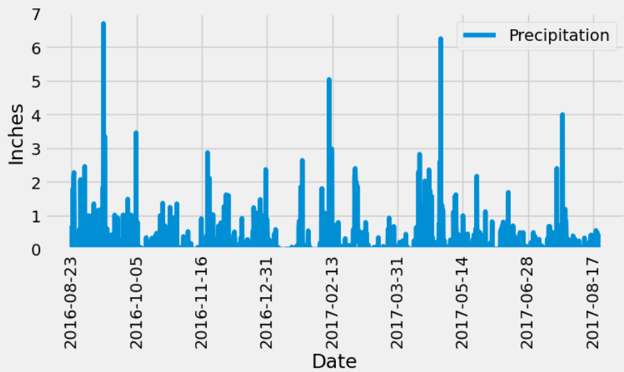
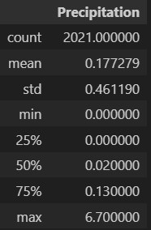
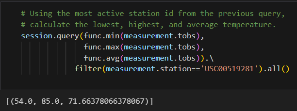
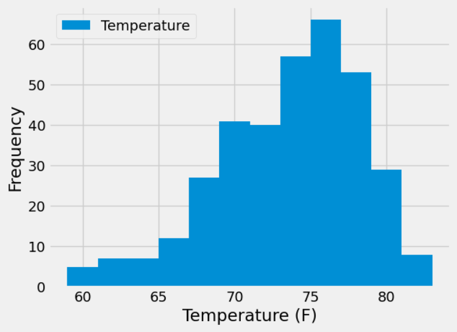
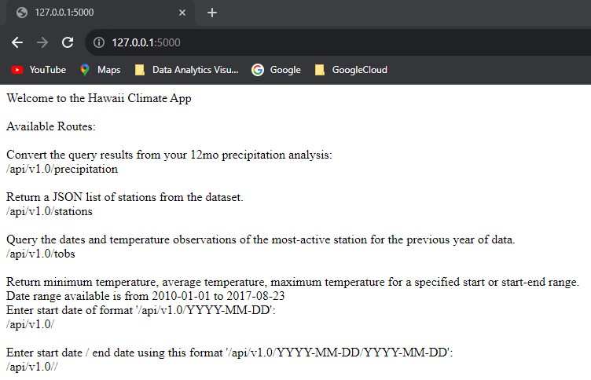
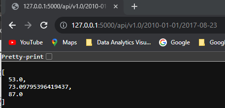

# Honolulu, Hawaii Climate Analysis
Using a provided SQLite database for Hawaii weather including temperature and precipitation from stations across the state from Jan 1, 2010 to Aug 23, 2017 to create a locally hosted webpage app to pull data based on given inputs.

# Features
* Explore the data to determine what features to host (climate.ipynb)
     * Use SQLAlchemy to connect to the SQLite database
     * Review precipitation for the last 12 months using a pandas dataframe
          * Create a plot of the precipitation using pandas 
          * Print summary statistics
     * Find the most active station and 
          * calculate the lowest, highest, and average temperatures
          * create a histogram of the temperature readings
* Create the locally hosted app with the following extensions
     1. /
          * homepage listing all the available routes.
     2. /api/v1.0/precipitation
          * Return the JSON representation of station precipitation readings by date for the last 12 months.
     3. /api/v1.0/stations
          * Return a JSON list of stations from the dataset.
     4. /api/v1.0/tobs
          * Return a JSON list of temperature observations of the most active station for the previous year.
     5. /api/v1.0/<start> and /api/v1.0/<start>/<end>
          * Return a JSON list of the minimum temperature, the average temperature, and the maximum temperature for a specified start or start-end range.
          * For a specified start, calculate TMIN, TAVG, and TMAX for all the dates greater than or equal to the start date.
          * For a specified start date and end date, calculate TMIN, TAVG, and TMAX for the dates from the start date to the end date, inclusive.

# Results

Last 12 Months Precipitation Readings | and Statistics
:-------------------------:|:-------------------------:
  |  

Most Active Station Temperature Stats | Most Active Station Temperature Histogram
:-------------------------:|:-------------------------:
  |  

Local App Homepage | Temperature Min, Mean, Max Start-End
:-------------------------:|:-------------------------:
  |  

# File Notes
* SurfsUp folder contains the solution and resource files for the Module 10 challenge
  * **climate.ipynb** contains the solution to Part 1: Analyze and Explore the Climate Data
  * **app.py** contains the solution to Part2: Design Your Climate App
  * Resources folder contains the SQL Lite database and related tables provided with the starter code
* Starter_Code folder contains the files provided in BCS/Canvas for completing the challenge.
   

# References
Data 
     * Menne, M.J., I. Durre, R.S. Vose, B.E. Gleason, and T.G. Houston, 2012: An overview of the Global Historical Climatology Network-Daily Database. Journal of Atmospheric and Oceanic Technology, 29, 897-910, https://journals.ametsoc.org/view/journals/atot/29/7/jtech-d-11-00103_1.xml.

The following references were used in creating the solution within the SurfsUp folder:
 * https://stackoverflow.com/questions/17578115/pass-percentiles-to-pandas-agg-function used as a reference for pulling in quartiles to the aggregate function for dataframe statistics
 
# Getting Started

## Prerequisites
You must have python, jupyter notebok / lab, conda, matplotlib, numpy, pandas, sqlalchemy, and datetime to execute the notebook.  
You must have python, sqlalchemy, datetime, and flask to run the application (app.py).

## Cloning Repo
$ git clone https://github.com/vt-bekah/sqlalchemy-challenge.git

$ cd sqlalchemy-challenge/SurfsUp

$ python app.py

# Built With
* Python v3.10.11
* jupyter notebook v6.5.2
* jupyterlab v3.6.3
* conda v23.5.0
* Flask v2.2.2

**Python Modules**
* matplotlib v3.7.1
* numpy v1.24.3
* pandas v1.5.3
* sqlalchemy v1.4.39
* datetime (native to Python)
